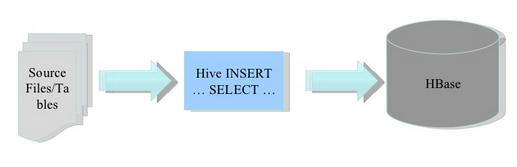
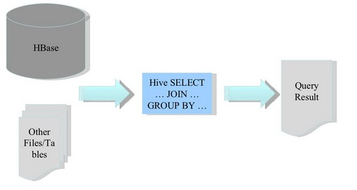
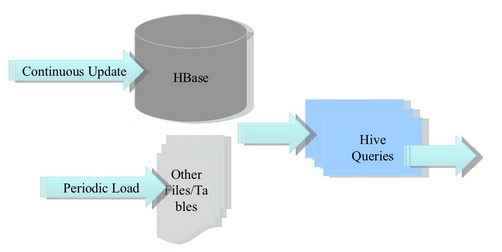

## Hive集成HBase详解
### 摘要
Hive提供了与HBase的集成，使得能够在HBase表上使用HQL语句进行查询 插入操作以及进行Join和Union等复杂查询
 
### 应用场景
1. 将ETL操作的数据存入HBase

2. HBase作为Hive的数据源

3. 构建低延时的数据仓库

### 使用
#### 1.从Hive中创建HBase表
- 使用HQL语句创建一个指向HBase的Hive表
```
CREATE TABLE hbase_table_1(key int, value string) //Hive中的表名hbase_table_1
STORED BY 'org.apache.hadoop.hive.hbase.HBaseStorageHandler'  //指定存储处理器
WITH SERDEPROPERTIES ("hbase.columns.mapping" = ":key,cf1:val") //声明列族，列名
TBLPROPERTIES ("hbase.table.name" = "xyz", "hbase.mapred.output.outputtable" = "xyz");  
//hbase.table.name声明HBase表名，为可选属性默认与Hive的表名相同，
//hbase.mapred.output.outputtable指定插入数据时写入的表，如果以后需要往该表插入数据就需要指定该值
```
- 通过HBase shell可以查看刚刚创建的HBase表的属性
```
$ hbase shell
HBase Shell; enter 'help<RETURN>' for list of supported commands.
Version: 0.20.3, r902334, Mon Jan 25 13:13:08 PST 2010
hbase(main):001:0> list
xyz                                                                                                           
row(s) in 0.0530 seconds
hbase(main):002:0> describe "xyz"
DESCRIPTION                                                           ENABLED                               
  {NAME => 'xyz', FAMILIES => [{NAME => 'cf1', COMPRESSION => 'NONE', VE true                                  
  RSIONS => '3', TTL => '2147483647', BLOCKSIZE => '65536', IN_MEMORY =>                                       
  'false', BLOCKCACHE => 'true'}]}                                                                            
row(s) in 0.0220 seconds
hbase(main):003:0> scan "xyz"
ROW                          COLUMN+CELL                                                                      
row(s) in 0.0060 seconds
```
- 使用HQL向HBase表中插入数据
```
INSERT OVERWRITE TABLE hbase_table_1 SELECT * FROM pokes WHERE foo=98;
```
- 在HBase端查看插入的数据
```
hbase(main):009:0> scan "xyz"
ROW                          COLUMN+CELL                                                                      
 98                          column=cf1:val, timestamp=1267737987733, value=val_98                            
1 row(s) in 0.0110 seconds
```
#### 2.从Hive中映射HBase
- 创建一个指向已经存在的HBase表的Hive表
```
CREATE EXTERNAL TABLE hbase_table_2(key int, value string) 
STORED BY 'org.apache.hadoop.hive.hbase.HBaseStorageHandler'
WITH SERDEPROPERTIES ("hbase.columns.mapping" = "cf1:val")
TBLPROPERTIES("hbase.table.name" = "some_existing_table", "hbase.mapred.output.outputtable" = "some_existing_table");
```
该Hive表一个外部表，所以删除该表并不会删除HBase表中的数据
注意
1. 建表或映射表的时候如果没有指定:key则第一个列默认就是行键
2. HBase对应的Hive表中没有时间戳概念，默认返回的就是最新版本的值
3. 由于HBase中没有数据类型信息，所以在存储数据的时候都转化为String类型

#### 3.多列及多列族的映射
如下表：value1和value2来自列族a对应的b c列，value3来自列族d对应的列
```
CREATE TABLE hbase_table_1(key int, value1 string, value2 int, value3 int) 
STORED BY 'org.apache.hadoop.hive.hbase.HBaseStorageHandler'
WITH SERDEPROPERTIES (
"hbase.columns.mapping" = ":key,a:b,a:c,d:e"
);
INSERT OVERWRITE TABLE hbase_table_1 SELECT foo, bar, foo+1, foo+2 
FROM pokes WHERE foo=98 OR foo=100;
```
#### 4.Hive Map类型在HBase中的映射规则
如下表:通过Hive的Map数据类型映射HBase表，这样每行都可以有不同的列组合，列名与map中的key对应，列值与map中的value对应
```
CREATE TABLE hbase_table_1(value map<string,int>, row_key int) 
STORED BY 'org.apache.hadoop.hive.hbase.HBaseStorageHandler'
WITH SERDEPROPERTIES (
"hbase.columns.mapping" = "cf:,:key"
);
INSERT OVERWRITE TABLE hbase_table_1 SELECT map(bar, foo), foo FROM pokes 
WHERE foo=98 OR foo=100;
```
cf为列族，其列名对应map中的bar,列值对应map中的foo
- 在HBase下查看数据
```
hbase(main):012:0> scan "hbase_table_1"
ROW                          COLUMN+CELL                                                                      
 100                         column=cf:val_100, timestamp=1267739509194, value=100                            
 98                          column=cf:val_98, timestamp=1267739509194, value=98                              
2 row(s) in 0.0080 seconds
```
- 在Hive下查看数据
```
hive> select * from hbase_table_1;
Total MapReduce jobs = 1
Launching Job 1 out of 1
...
OK
{"val_100":100}    100
{"val_98":98}    98
Time taken: 3.808 seconds
```
注意:由于map中的key是作为HBase的列名使用的，所以map中的key类型必须为String类型
以下映射语句都会报错
1.
```
CREATE TABLE hbase_table_1(key int, value map<int,int>) 
STORED BY 'org.apache.hadoop.hive.hbase.HBaseStorageHandler'
WITH SERDEPROPERTIES (
"hbase.columns.mapping" = ":key,cf:"
);
```
原因：map中的key必须是String
2.
```
CREATE TABLE hbase_table_1(key int, value string) 
STORED BY 'org.apache.hadoop.hive.hbase.HBaseStorageHandler'
WITH SERDEPROPERTIES (
"hbase.columns.mapping" = ":key,cf:"
);
```
原因：当hbase.columns.mapping中的列族后面为空时(形如cf:),说明在Hive中其对应的数据类型为map，而这条语句中对应的是String所以报错
#### 5.Hive还支持简单的复合行键
如下：创建一张指向HBase的Hive表，行键有两个字段，字段之间使用~分隔
```
CREATE EXTERNAL TABLE delimited_example(key struct<f1:string, f2:string>, value string) 
ROW FORMAT DELIMITED 
COLLECTION ITEMS TERMINATED BY '~' 
STORED BY 'org.apache.hadoop.hive.hbase.HBaseStorageHandler' 
WITH SERDEPROPERTIES (
  'hbase.columns.mapping'=':key,f:c1');
```
#### 6.使用Hive集成HBase表的需注意
1. 对HBase表进行预分区，增大其MapReduce作业的并行度
1. 合理的设计rowkey使其尽可能的分布在预先分区好的Region上
1. 通过set hbase.client.scanner.caching设置合理的扫描缓存